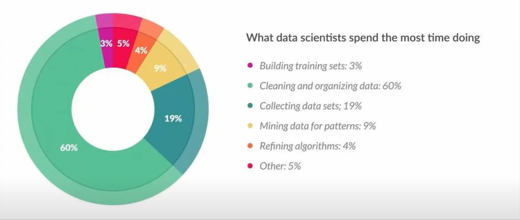

# Feature Engineering

## Problems without implementing the feature engineering
In designing the AI model, most time is consumed on cleaning the data, Here is the data from Fobes.

## What is feature engineering
Process of extracting useful features from raw data using maths,stats and domain knowledge.

## Basic examples of Feature engineering
- Outlier Detection
- one hot encoding
- handling missing data
