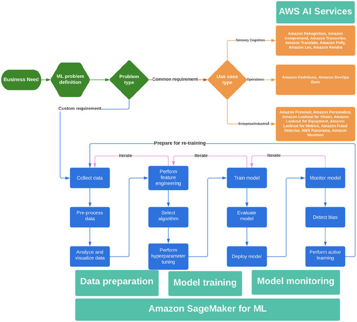
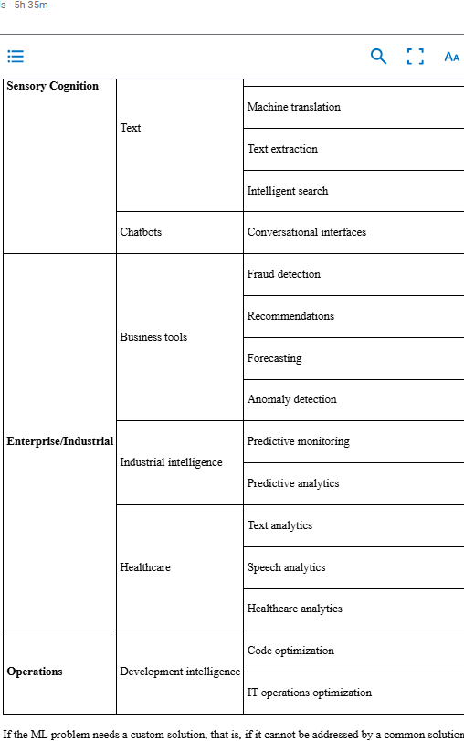

# ML WorkFlow

## what is a ML workflow

A Machine Learning (ML) workflow refers to the series of steps or stages involved in building and deploying a machine learning model. 
These steps help guide the process from gathering data to evaluating and deploying a model for use.

Common ML vs Custom ML
when solving an inventory management issue, you may use ML to implement demand forecasting to increase efficiency in your operations. 
Once there is a clear need and we have adequately understood the problem, we must determine if it can be addressed by a common ML solution or one that needs custom development.
The following table guides you on the common problem types for which AWS provides pre-trained ML models called AWS AI services by means of an API that you can easily include in your application without having to worry about model training. 

## Custom case
If the ML problem needs a custom solution, that is, if it cannot be addressed by a common solution discussed earlier, we will have to execute the steps in the ML workflow, starting with data preparation and followed by model training, deployment and optionally, monitoring. That is why our ML workflow is grouped into three major areas: data preparation, model training and model monitoring
